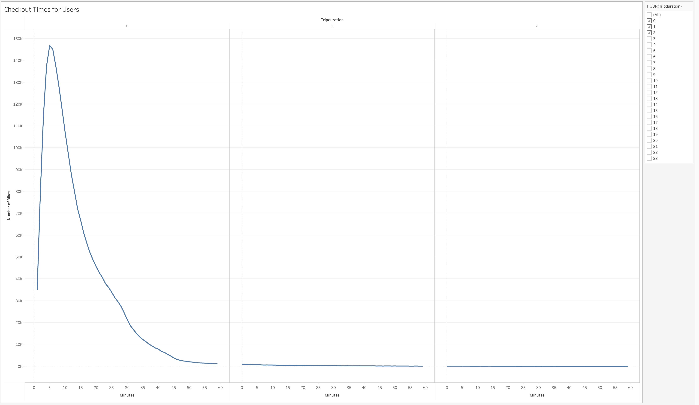
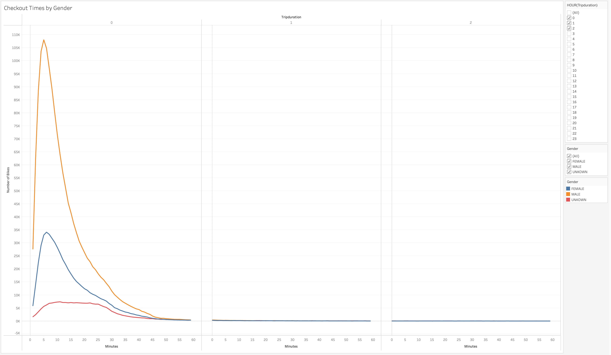
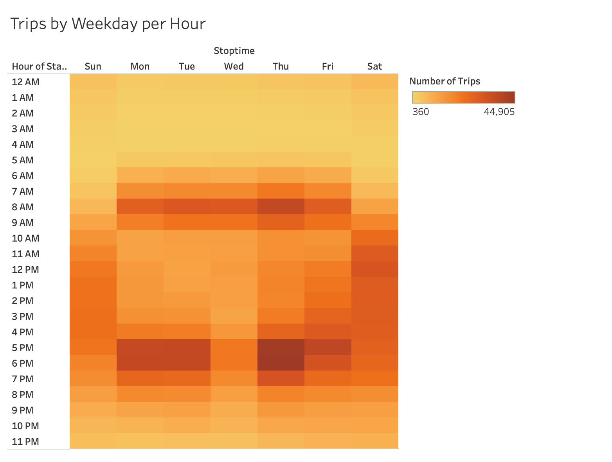
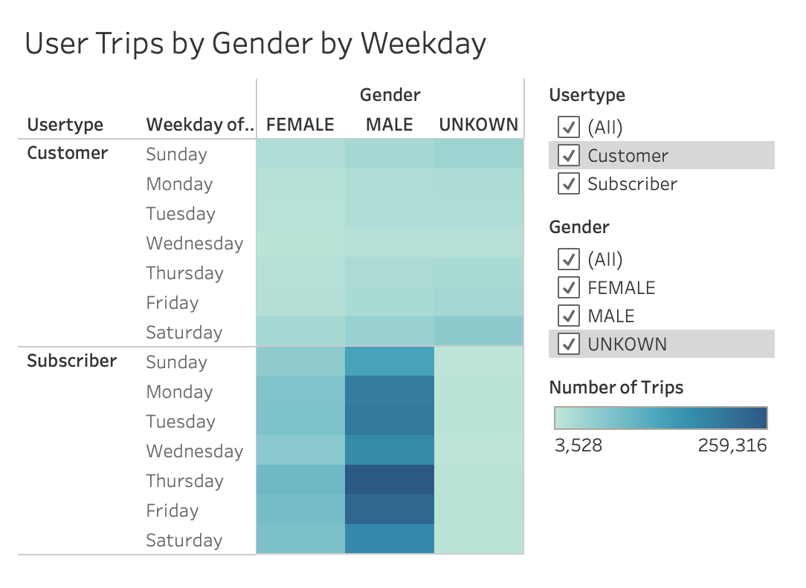

# NYC CitiBike Bikesharing Data Visualization & Analysis

## Overview

The New York City CitiBike bikesharing program is a well known and popular service in one of the world's largest and most highly trafficked cities. We have sourced data on the CitiBike program to craft an analysis centered around key data visualizations using Tableau. The aim of our analysis is to gather insights from data on the CitiBike bikesharing program to determine the viability of a similar program in Des Moines, Iowa and relay the supporting findings to potential investors looking to seed-fund the venture.

The data used for our visualizations is sourced directly from the NYC CitiBike website in its "system data" resource (https://ride.citibikenyc.com/system-data). We focused our analysis on CitiBike bikesharing data from August of 2019, as we wanted to look at recent data from an active, warm-weather month. The data source files were too large to include in this online repository, however, it may be downloaded from the link below.

Data Source (Zip Compressed CSV File):  
https://s3.amazonaws.com/tripdata/201908-citibike-tripdata.csv.zip

To view the data in our interactive Tableau Story, please visit the link below.

Tableau Public (Interactive Data Visualizations):
https://public.tableau.com/app/profile/kevin.eapen/viz/NYC_CitiBike_Challenge_Visualizations/NYCCitiBike

The following section contains 7 key data visualizations in our analysis, with a brief description of the results for each.

## Results

### Checkout Times for Users

This visualization plots the length of time that bikes are checked out for all riders. The curve of the charted line reaches its peak at around 5 minutes, with 146,752 number of bikes being ridden for trips at this duration. The vast majority of trips last less than 30 minutes, and virtually no trips last more than 1 hour.

### Checkout Times by Gender

The above visualization charts the length of time that bikes are checked out for all genders, with each gender represented by a different color line. The shapes of the curves suggest that the pattern of usage is similar across all genders, with male and females checking out a peak number of bikes for 5 and 6 minutes at a time (respectively) and other genders checking out a peak number of bikes for a duration of 11 minutes. The sample size of the "unknown" category of genders is significantly lower, however, so the distribution of this data segment may not be as normalized. The data from this visualization also reveals that the male gender checks out many more bikes than any other gender, with a peak of 108,087 bikes checked out at 5 minutes trip duration. By comparison, the female gender peaks at 34,151 bikes checked out out at 6 minutes trip duration, and the "unkown" genders peak at 7,389 bikes checked out at 11 minutes trip duration. This means that users of the CitiBike program are predominantly of the male gender.

### Trips by Weekday per Hour

The above heatmap visualizes the number of bike trips by weekday for each hour of the day. The frequency of bike trips tends to heat up around the hours of 8AM, 5PM, and 6PM for days of the week, Monday through Friday. On the weekend days (Saturday and Sunday), the frequency of bike trips is a more even distrbution throughout the day, with somewhat hotter activity hours between 11AM-6PM.

### Trips by Gender (Weekday per Hour)
.png)

This heatmap displays the number of bike trips by gender for each hour of each day of the week. The pattern of frequency of bike trips seem to be similar hours for each day of the week between male and female genders. Unknown genders do not display as clear a pattern throughout the week, however, this may be due to the relatively low number of users belonging to this category relative to the other genders. This may result in less differentiation between the lighter low-frequency shades of the heatmap, making it harder to discern the pattern of use through this heatmap for the unknown genders category. As in previous visualizations, this heatmap suggests Males use the bikeshare program more overall, as the heatmap shows darker colors for the male gender chart, signifying a higher number of trips taken.

### User Trips by Gender by Weekday

The above heatmap shows the number of bike trips broken down by gender for each day of the week by each "Usertype". This visualization indicates that users of the male and female genders that are subscribers utilize the program more by taking more trips than non-subscribing customer usertypes of the two genders. The unknown genders category counters this tendency with the inverse being true for the subscriber and customer usertypes. Users of the unknown genders category who are subscribers utililze the program less than non-subscribing customer usertypes by taking less trips. Additionally, Thursday is the most popular day for subscribing users across all gender categories, with the most number of trips taken on that day for each gender. Among the non-subscribing customer usertype, the most popular day for renting CitiBikes is Saturday, and this is true across all genders of this usertype. 

### Bike Repairs (Number of Trips)
.png)

Besides studying CitiBike user behavior, we decided to also study individual bike usage by bike ID. We felt this may provide insights into cost related topics, such as estimated bike repairs needed, which may prove relevant to program viability and investment decsions for the potential Des Moines venture. The visualization above represents an estimation of the bike repair need by the number of trips taken for each bike ID, as a heatmap. This heatmap uses a stepped gradient with diverging temperature related colors (warmer colors representing higher number of trips and cooler colors representing lower number of trips for each individual bike ID). With this diagram we can tell that a fairly small proportion of the total bikes in use are very heavily utilized. If the program were to only focus on repairing the "red-level" bikes, then it seems like a manageable task without having to stop the service from the number of bikes that need to be taken out of rotation relative to the total existing bikes.

### Bike Utilization (Total Trips Duration)
.png)

To further study how bikes are utilized, we decided to measure individual bike usage by the total time of usage in the month for each bike. To examine this we created a packed bubbles visualizaton of bike utilization by the sum of total trips duration (seconds) for all trips made by each bike ID. The larger and darker bubbles represent bike IDs of higher bike utilization. In accord with the previous visualzation's results, only a handful of bubbles (bikes) are shaded as dark blue or oversized, indicating that the number of bikes in need of repair is low relative to the total bikes. If the Des Moines venture could emulate the same proportion of total bikes relative to the population, then investors can be assured that bike maintenance schedules and associated costs should not disrupt the service or be a greater cause for concern.

## Summary

To summarize, our key visualizations for the CitiBike bikeshare program has provided useful and detailed insights into how the bikeshare program is successfully utilized and maintained. With further research, this success can be translated to other markets including Des Moines, Iowa.

Here are the key takeaways for each NYC CitiBike bikeshare analysis visualization:
- *Checkout Times for Users*
    - The number of bikes checked out peaks at a trip duration of 5 minutes across all users.
- *Checkout Times by Gender*
    - The number of bikes checked out peaks at a trip duration of 5 minutes for the male gender, 6 minutes for the female gender, and 11 minutes for unknown genders.
- *Trips by Weekday per Hour*
    - Bikeshare usage frequency increases during the hours of 8AM, 5PM, and 6PM for weekdays Monday-Friday. Meanwhile, bikeshare usage frequency is relatively higher throughout the day during the hours of 11AM-6PM on weekends (Saturday-Sunday).
- *Trips by Gender (Weekday per Hour)*
    - The usage patterns for hours throughout the week are very similar between the male and female genders. The unknown genders heatmap may contain a similar pattern, but is far less discernible on the heatmap due to low overall number of trips taken by this group relative to the male and female groups. The male gender group has a higher usage of the bikeshare program overall, and this is true at about any given time for any day of the week.
- *User Trips by Gender by Weekday*
    - Male and Female subscribers take more trips on CitiBikes throughout the week than Male and Female non-subscribing customers. The inverse is true for unknown genders. Thursday is the most popular day for bikeshare usage among subscribers, meanwhile, Saturday is the most popular among non-subscribing customers.
- *Bike Repairs (Number of Trips)*
    - According to the number of trips per bike, a small proportion of the total bikes are heavily utilized, or in the "red-level" needing repair. This suggest bike maintenance is manageable without interruption of the program. 
- *Bike Utilization (Total Trips Duration)*
    - Bike utilization, according to the sum of total trips duration (seconds) for all trips made by each bike, is relatively evenly distributed and only high in a small proportion of total bikes. This concurs with the previous analysis, inferring that bike maintenance expecations are relatively low and manageable.

 
For further analysis, I would suggest exploring the CitiBike bikeshare data by implementing the following visualtions.

 
Addtional Visualizations:

 

- Create a map visualization overlaying start and end station latitude and longitude pairs, marked by color, over a map with markers for key categorical places of interest in the city. We could use the insights from this visualization to determine the most optimal station locations when planning the bikeshare program in Des Moines.
- Create an additional map visualization plotting the start and end station latitude and longitude pairs, marked by color, filtered by gender. We can utilize this visualization as an analytical resource to study the relationship of station locations to the number of trips taken by each gender. This may allow us to better understand how Females and "unknown" genders interact with bikesharing, and we could possibly plan a more equitable bikeshare program in Des Moines across all genders.